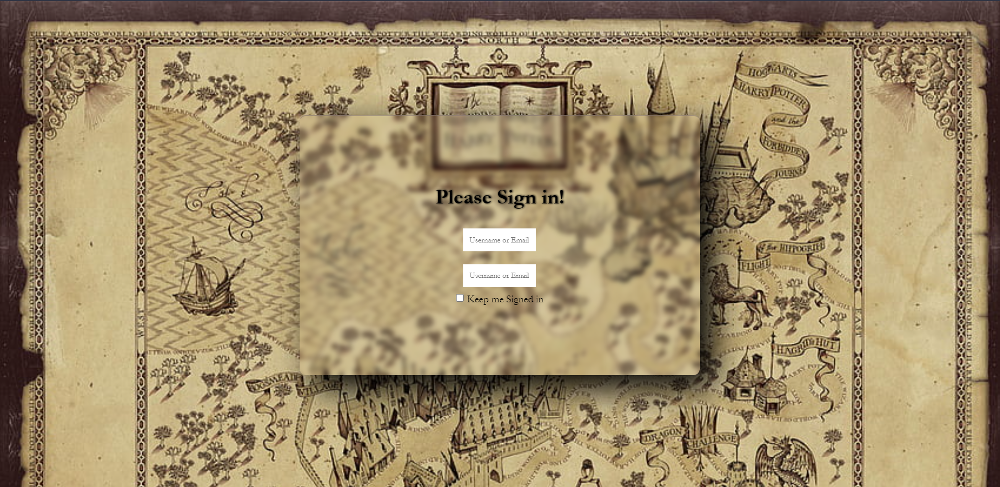

# Glass UI Login Form

This is a modern and stylish login form designed using HTML and CSS. The form features a glass-like design with smooth animations and visually appealing elements.

## Preview

## Customization

Form can be customized by:

- Uncommenting the login button element.
- Modifying the background image in the CSS.
- Adjusting colors, fonts, and other styling elements.

## Credits

- Background image: [Image Source](https://www.pxfuel.com/en/desktop-wallpaper-tlfzw)
- Google Font: [EB Garamond](https://fonts.google.com/specimen/EB+Garamond)

# Glass UI Login Form code Content and Explanation

## HTML

- The `<!DOCTYPE html>` declaration specifies the document type and version of HTML.
- The `<html>` tag encloses the entire HTML document, and the `lang` attribute specifies the language.
- The `<head>` section contains metadata and links to external resources like stylesheets.
- The `<body>` tag contains the content of the webpage.
- The `.container` class creates a container to center the card element.
- The `.card` class represents the main card element containing the login form.
- The `.content` class defines the content inside the card, including the form fields and labels.
- Input fields are used for entering username/email and password.
- A checkbox and label for "Keep me Signed in" are included.
- The button element is currently commented out.

## CSS

- The CSS code is used for styling the HTML elements.
- The `@import` rule is used to import a Google Font.
- The `*` selector applies styles to all HTML elements, resetting margins, padding, and box-sizing.
- The `body` style sets the background image, alignment, and appearance of the form.
- The `.container` class centers the content horizontally and vertically.
- The `.card` class styles the card containing the form with a box shadow, border, and backdrop filter for a glass effect.
- The `.content` class styles the content inside the card, including text alignment and spacing.
- The `.text_field` class styles the input fields with width, height, padding, and margins.
- The `.content h1` style defines the appearance of the heading.
- The `.form-input button` class styles the login button with background, border, padding, and cursor.
- The `.form-input button:hover` style changes the background color on hover.
